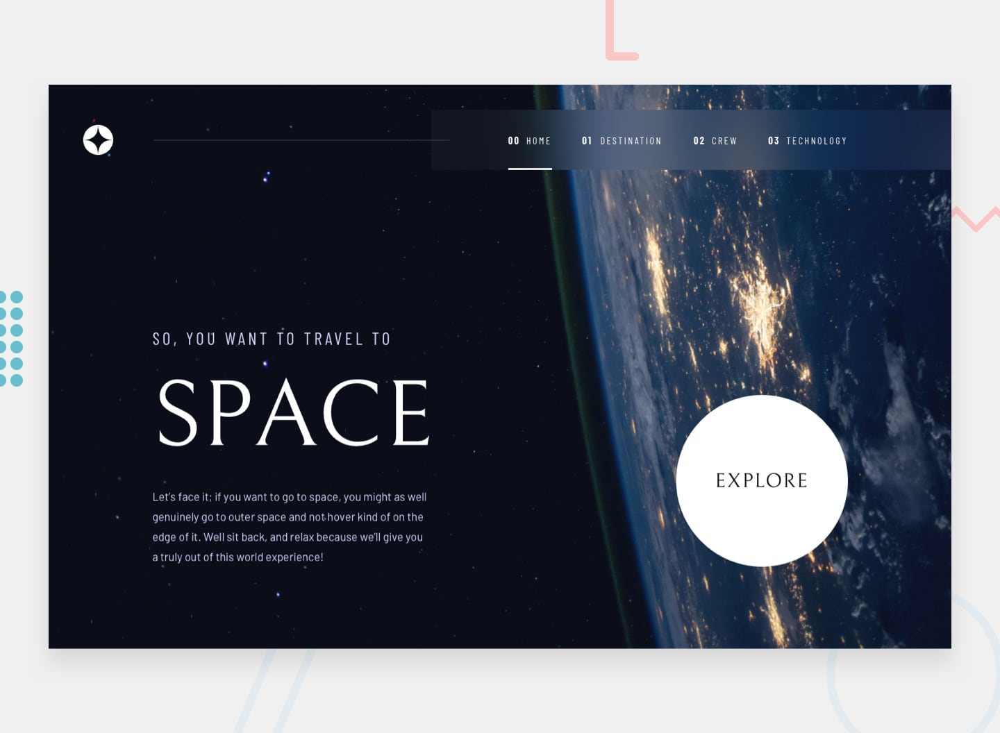

# Frontend Mentor - Space tourism website solution

This is a solution to the [Space tourism website challenge on Frontend Mentor](https://www.frontendmentor.io/challenges/space-tourism-multipage-website-gRWj1URZ3). Frontend Mentor challenges help you improve your coding skills by building realistic projects. 

## Table of contents

- [Overview](#overview)
  - [The challenge](#the-challenge)
  - [Screenshot](#screenshot)
  - [Links](#links)
- [My process](#my-process)
  - [Built with](#built-with)
- [Author](#author)

## Overview

### The challenge

Users should be able to:

- View the optimal layout for each of the website's pages depending on their device's screen size
- See hover states for all interactive elements on the page
- View each page and be able to toggle between the tabs to see new information

### Screenshot

### Links

- Solution URL: [Add solution URL here](https://github.com/Gerson77/Space-tourism)
- Live Site URL: [Add live site URL here](https://space-tourism-steel-ten.vercel.app/)

## My process

I decided to create the project using React for page routing and using the new version of TailwindCSS. In addition to adding animations to almost everything on the screen.

### Built with

- [React](https://reactjs.org/) - JS library
- [TailwindCSS](https://tailwindcss.com/) - For styles
- [GSAP](https://gsap.com/) - Animations

## Author

- Website - [Gerson Santos](https://portifolio-puce-theta-49.vercel.app/)
- Frontend Mentor - [@Gerson77](https://www.frontendmentor.io/profile/Gerson77)
- Github - [@Gerson77](https://github.com/Gerson77)
